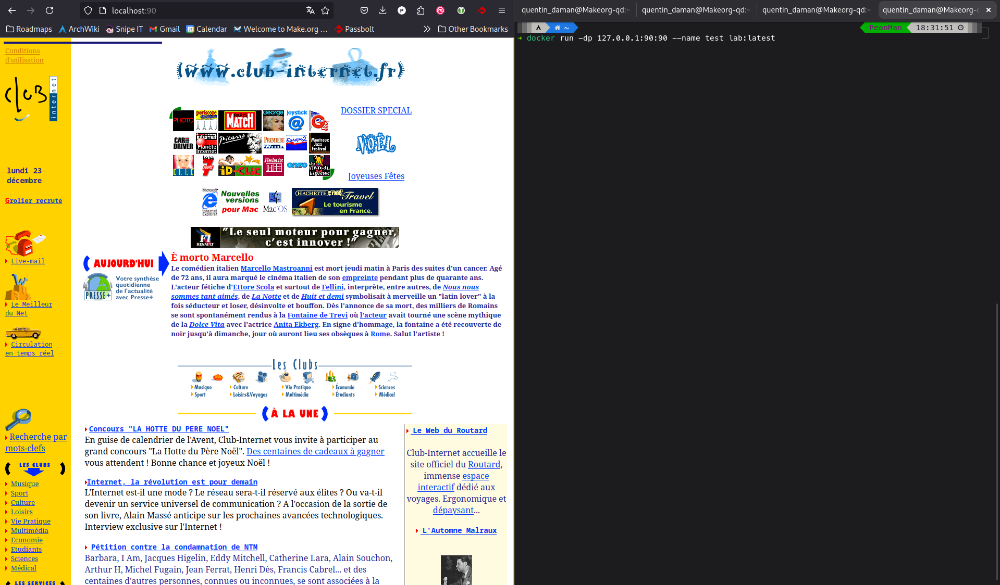

# 🐳 Lab – Docker & Nginx

## 🧭 Contexte

Ce lab visait à prendre en main Docker et à personnaliser une image contenant un serveur web Nginx. L’objectif était de générer dynamiquement un fichier de configuration à partir d’un template et d’une variable d’environnement.

## 🧪 Objectifs du lab

- Prise en main de Docker CLI
- Construction d’une image personnalisée à partir d’une base Alpine
- Substitution dynamique d’une variable d’environnement (`$WEBSITE_SLUG`)
- Lancement d’un container Nginx servant une page HTML spécifique
- Accès au service web via le port exposé

## ⚙️ Étapes principales

1. Récupération du Dockerfile et de l’image de base `nginx_base`
2. Complétion du `Dockerfile` pour injecter la variable d’environnement
3. Utilisation du script `entrypoint.sh` pour générer le fichier `.conf`
4. Construction de l’image avec `docker build`
5. Lancement du container avec `docker run -p 90:90`
6. Vérification via `curl` ou navigateur

## 🖼️ Captures d’écran

| Vue | Exemple | Étape |
|-----|---------|-------|
| Structure du projet Docker + configuration Nginx générée dans le conteneur |  | Étapes 1 et 5 |
| Contenu du Dockerfile avec substitution de variable d’environnement |  | Étape 3 |
| Container en cours d’exécution + accès navigateur via le port 90 |  | Étape 6 |

## ✅ Compétences mobilisées

- Manipulation de Docker CLI
- Création d’images personnalisées
- Utilisation d’entrypoint, de templates et de variables d’environnement
- Exposition de ports & test HTTP avec `curl`
