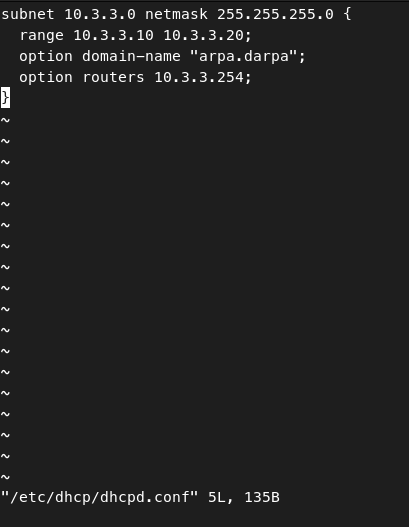
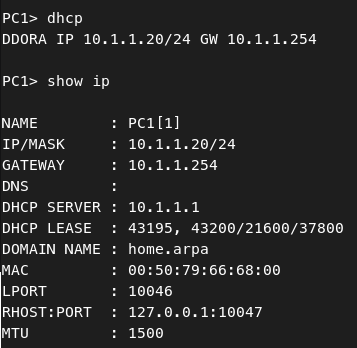
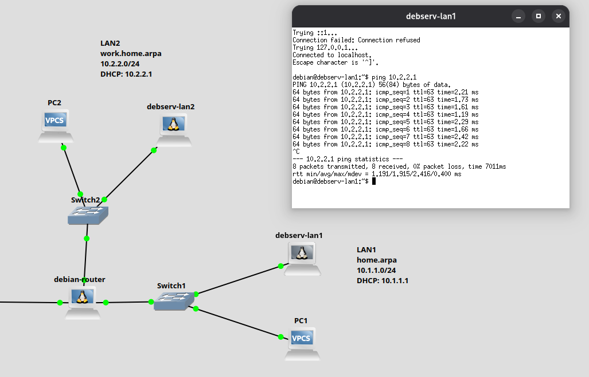
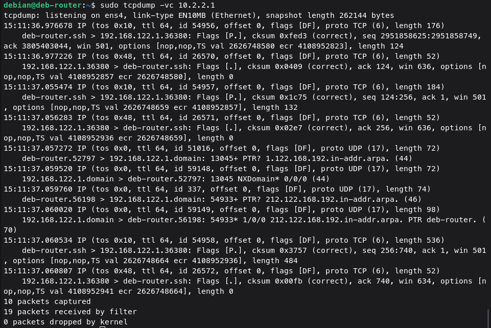
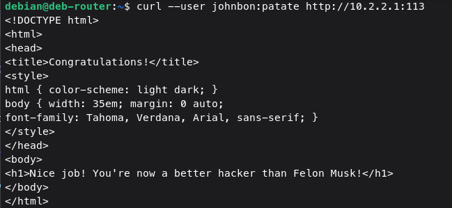

# 🌐 Labs Réseaux – GNS3

Ces labs ont été réalisés avec GNS3 dans le cadre de la formation BTS SIO SISR. Ils m'ont permis de configurer des serveurs (DHCP, DNS, web), de simuler des réseaux interconnectés et d’analyser le trafic.

## 🧭 Contexte

Les labs étaient conçus pour recréer des environnements réseau complets en utilisant GNS3, avec des machines Debian, des routeurs, et des clients sur plusieurs LAN.

## 🧪 Labs réalisés

- **Lab 1 : Configuration d’un serveur DHCP** sur Debian  
- **Lab 2 : Routage entre deux LAN + résolution DNS inter-réseaux**
- **Lab 3 : “Mystery Web Server”**
  - Authentification via `SSH`
  - Découverte de service caché
  - Interception de trafic avec `tcpdump`

## 🖼️ Captures d’écran

| Vue | Exemple | Lab concerné |
|-----|---------|--------------|
| Configuration du serveur DHCP |  | **Lab 2** |
| Demande d'une adresse IP par le client |  | **lab2** |
| Test de connectivité entre LAN1 et LAN2 (`ping`) |  | **Lab 2** |
| Interception d'une trame HTTP contenant une authentification (`tcpdump`) |  | **Lab 3 – Mystery Web Server** |
| Accès au serveur protégé via `curl` avec authentification HTTP Basic |  | **Lab 3 – Mystery Web Server** |

## ✅ Compétences mobilisées

- Configuration de serveurs réseau (DHCP, DNS, web)
- Routage entre réseaux (configuration de gateway)
- Analyse réseau (`tcpdump`, `nmap`)
- Résolution de problèmes en environnement simulé
